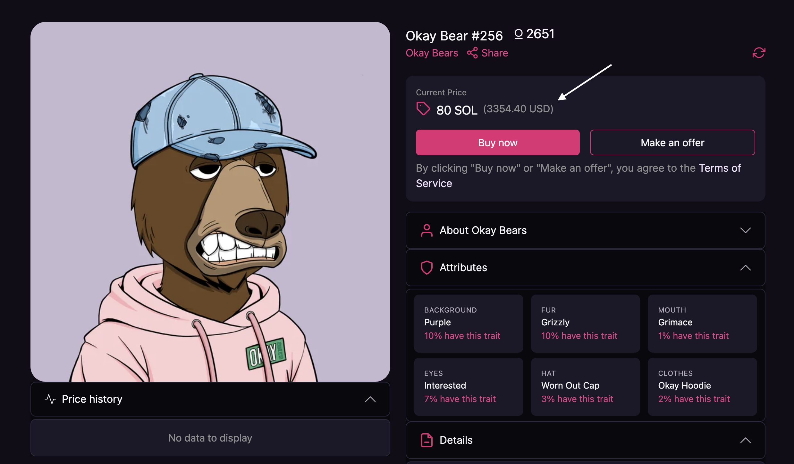

    

<h1 align="center">Sol 2 Fiat</h1>

  A chrome extension for converting Solana to Fiat in MagicEden.  (Come on ME, you have one job 😐)

 

  Built with ❤︎ by
  <a href="https://twitter.com/kahseng94">Jayson Ng</a>
  </a>

 

# Getting Started

## Before you start

- I use **Coingecko's free tier API** for this project. Their rate limit is up to **50 per minute**. Not sure it's per IP Address or what, if there is problem with the API, let me know.
- I **will not** upload this extension to the Chrome web store, because I am sure that MagicEden and other NFT marketplace will implement this feature in the future. It would be a waste of time and money to do all this. Just follow the installation steps and use it as a local extension.

## Installation

1. Download this project as ZIP, unzip it and save it anywhere you want.
2. Open the Extension Management page by navigating to chrome://extensions.
   - Alternatively, open this page by clicking on the Extensions menu button and selecting Manage Extensions at the bottom of the menu.
   - Alternatively, open this page by clicking on the Chrome menu, hovering over More Tools then selecting Extensions
3. Enable Developer Mode by clicking the toggle switch next to Developer mode.
4. Click the Load unpacked button and select the **extension directory where `manifest.json` is located at**.
5. After that, you will see an extension appear like the image below.
6. Yay, you have installed the extension, refreshed the marketplace page to see the result.

## Demo

Your MagicEden item detail page should look like this.

# 🚗&nbsp; Roadmap

- [x] Convert Sol price to USD for MagicEden
- [ ] Add different currency
- [ ] Create one for other marketplace e.g. Hyperspace, CoralCube
- [ ] Any suggestion?

 

# 🏢&nbsp; System Design

 

# Community

## ❤️&nbsp; Contributions

Everyone is welcome to contribute.

## 📫&nbsp; Have a question? Want to chat? Ran into a problem?

You can always **reach out to me directly** via the [twitter](https://twitter.com/jayson94) or submit an issue on github.

## 🤝&nbsp; Found a bug? Missing a specific feature?

Feel free to **file a new issue** with a respective title and description on the the [kahseng94/sol2fiat](https://github.com/kahseng94/sol2fiat/issues) repository. If you already found a solution to your problem, **I would love to review your pull request**!

 

# 📘&nbsp; License

Distributed under the MIT License. See LICENSE.md for more information.
 

  Data Provided by 
  <a href="www.coingecko.com">CoinGecko</a>
  </a>

